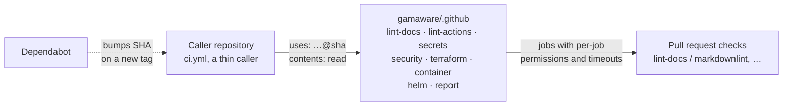

# gamaware/.github

Shared community health files, hardened reusable GitHub Actions workflows and the social preview generator for every
repository in the [AWS DevOps portfolio](https://github.com/gamaware/aws-devops-portfolio).

[](https://github.com/gamaware/.github/actions/workflows/ci.yml)
[](LICENSE)


## What this provides

- **Community health files** that GitHub applies to every repository without its own copy: contributing guide, code
  of conduct (Contributor Covenant 2.1), support, security policy, issue forms and a pull request template that asks
  for evidence and documentation updates.
- **Eight reusable workflows** (`on: workflow_call`) so every repository runs the same checks under the same check
  names.
- **A social preview generator** that renders 1280x640 previews in the portfolio's editorial-split blueprint style.

## Inspect the deliverable

- Reusable workflows: [`.github/workflows/`](.github/workflows/)
- This repository's own pipeline: [`ci.yml`](.github/workflows/ci.yml) and
  [`scorecard.yml`](.github/workflows/scorecard.yml)
- Social preview generator: [`assets/social-preview/render.py`](assets/social-preview/render.py)
- Decisions: [`docs/adr/`](docs/adr/README.md)

## Architecture



A repository keeps a thin `ci.yml` that calls only the workflows its stack needs, pinned to a full commit SHA of this
repository. Each reusable workflow starts from `permissions: {}`, grants `contents: read` per job, pins every action by
SHA, verifies every downloaded release binary against a SHA-256 checksum, sets `timeout-minutes` on every job and passes
inputs to shell steps only through environment variables. Source: [`docs/diagrams/`](docs/diagrams/).

## Reusable workflows

| Workflow | Jobs (check names) | Inputs (type, default) |
| --- | --- | --- |
| `lint-docs.yml` | `markdownlint`, `links`, `vale` | `markdown-globs` (string, `**/*.md` + `#node_modules`), `run-links` (bool, true), `lychee-args` (string), `run-vale` (bool, true), `vale-paths` (string, `.`) |
| `lint-actions.yml` | `actionlint`, `zizmor` | `zizmor-persona` (string, `regular`), `zizmor-min-severity` (string, `low`), `zizmor-version` (string, `1.30.1`) |
| `secrets.yml` | `gitleaks` | `scan-history` (bool, true), `gitleaks-config` (string, empty: `.gitleaks.toml` if present) |
| `security.yml` | `semgrep`, `trivy`, `checkov` | `run-semgrep` (bool, true), `semgrep-config` (string, `p/default`), `run-trivy` (bool, true), `trivy-severity` (string, `HIGH,CRITICAL`), `trivy-skip-dirs` (string, empty), `run-checkov` (bool, true), `checkov-config` (string, `.checkov.yaml`) |
| `terraform.yml` | `fmt`, `validate (<dir>)` | `working-directories` (JSON array string, `["."]`), `terraform-version` (string, `1.16.4`), `tflint-version` (string, `v0.64.0`), `run-tests` (bool, true) |
| `container.yml` | `hadolint`, `build-scan` | `context` (string, `.`), `dockerfile` (string, `Dockerfile`), `image-name` (string, `app`), `trivy-severity` (string, `HIGH,CRITICAL`), `trivy-ignore-unfixed` (bool, true) |
| `helm.yml` | `chart (<dir>)` | `charts` (JSON array string, `["charts"]`), `helm-version` (string, `v4.3.0`), `kubernetes-version` (string, `1.34.0`), `ignore-missing-schemas` (bool, false) |
| `report.yml` | `pdf`, `evidence` | `report-path` (string, `report/REPORT.md`), `pandoc-args` (string), `artifact-name` (string, `report-pdf`), `evidence-command` (string, empty skips), `evidence-path` (string, `evidence`), `python-version` (string, `3.13`) |

Behavior worth knowing before calling them:

- `lint-docs` reads the caller's `.markdownlint.yaml` and `.vale.ini`; `run-vale: true` fails when `.vale.ini` is
  missing.
- `security` runs Checkov with `--config-file` when `checkov-config` exists (the file must set `directory`), otherwise
  on the whole repository. Trivy honors the caller's `.trivyignore`. Declare intentional fixtures there or in the
  Checkov config; never skip them wholesale.
- `terraform` runs `init -backend=false`, so it never needs cloud credentials. `terraform test` runs only in
  directories with `*.tftest.hcl` files; use mock providers for them. TFLint reads `.tflint.hcl` from the root.
- `container` builds with `load: true` and never pushes. Hadolint reads the caller's `.hadolint.yaml`.
- `helm` adds the HTTP repositories listed under `dependencies` in `Chart.yaml`, builds dependencies, then lints and
  renders each chart once per `ci/*-values.yaml` file (or once with default values) for `kubernetes-version` and
  validates the output with kubeconform in strict mode.
- `report` builds the PDF with the `pandoc/latex` image pinned by digest and uploads it as an artifact. With
  `evidence-command` set, it reruns that command and fails if `evidence-path` differs from the commit.

## Call a workflow from another repository

Reference a full commit SHA of this repository, never a branch or a bare tag, and grant only `contents: read`:

```yaml
name: ci

on:
  pull_request:
  push:
    branches: [main]

permissions: {}

concurrency:
  group: ci-${{ github.ref }}
  cancel-in-progress: true

jobs:
  lint-docs:
    uses: gamaware/.github/.github/workflows/lint-docs.yml@<full-40-character-sha> # v1.0.0
    permissions:
      contents: read

  secrets:
    uses: gamaware/.github/.github/workflows/secrets.yml@<full-40-character-sha> # v1.0.0
    permissions:
      contents: read

  terraform:
    uses: gamaware/.github/.github/workflows/terraform.yml@<full-40-character-sha> # v1.0.0
    permissions:
      contents: read
    with:
      working-directories: '["modules/network", "envs/dev"]'
```

Pin the commit of a release tag and keep the tag as a trailing comment. Find the SHA with
`git ls-remote https://github.com/gamaware/.github 'refs/tags/v1.0.0^{}'`. Dependabot's `github-actions` ecosystem
reads the comment and bumps both the SHA and the comment when a new tag appears. Keep caller job keys stable
(`lint-docs`, `lint-actions`, `secrets`, `security`, `terraform`, `container`, `helm`, `report`) so required check
names such as `lint-docs / markdownlint` are identical across repositories.

Do not pass `secrets: inherit`; none of these workflows needs a secret.

## Social preview generator

`assets/social-preview/render.py` renders a spec to a 1280x640 PNG with headless Chrome and the vendored Inter and
JetBrains Mono fonts (SIL OFL 1.1, licenses in [`fonts/`](assets/social-preview/fonts/)). It needs only Python 3 and
Chrome or Chromium; set `CHROME` to override the binary.

From another repository, render with a shallow clone of this one:

```bash
git clone --depth 1 https://github.com/gamaware/.github /tmp/shared
python3 /tmp/shared/assets/social-preview/render.py docs/assets/social-preview.json docs/assets/social-preview.png
```

A spec is JSON with paths relative to the spec file:

```json
{
  "color": "#146C43",
  "heading": ["GitHub Actions to AWS", "without stored keys"],
  "subtitle": "OIDC · least-privilege role · security gates",
  "steps": [
    {"label": "Trust policy", "icon": "icons/role.svg"},
    {"label": "Scoped deploy role"},
    {"label": "Gated release"}
  ],
  "illustration": "illustration.svg",
  "mark": "mark.svg"
}
```

- `heading` takes one to three lines; `steps` takes exactly three, each with an optional 48 px icon.
- `illustration` is an SVG fragment for a `0 0 728 640` viewBox. The generator adds the blueprint grid, crop marks,
  white 2.5 px round strokes and JetBrains Mono 18 px text, so the same fragments used for Upwork covers render
  unchanged. Use `#FFC34D` (amber) for the single highlighted element.
- `color` is the offer's cover color:

| Offer | Color |
| --- | --- |
| Terraform audit and fix | `#844FBA` |
| CI/CD pipeline (GitHub Actions to AWS) | `#146C43` |
| Security and IAM review | `#232F3E` |
| Kubernetes on EKS | `#2356C2` |
| Containerize and deploy to ECS | `#A6400E` |
| AWS foundation for a new project | `#0B5563` |
| DevOps and Well-Architected assessment | `#2B2F77` |
| AWS cost audit | `#5E4A12` |
| Migration to AWS | `#7B1F6A` |
| Workshop and mentoring | `#9E1C2F` |

`make preview` regenerates this repository's own preview from
[`examples/github.json`](assets/social-preview/examples/github.json).

## Verify locally

Prerequisites: Python 3.13, pre-commit 4.6.2 and Git. Hook tools (actionlint, zizmor, gitleaks, markdownlint-cli2,
yamllint, shellcheck, shellharden, ruff) install through pre-commit on first run; shellharden builds with a Rust
toolchain that pre-commit bootstraps if needed.

```bash
pre-commit install --install-hooks
pre-commit install --hook-type commit-msg
make verify
```

Expected output: every hook reports `Passed`. The first run takes a few minutes while hook environments install;
later runs take under 30 seconds. `make vale` runs the prose check that CI runs in `lint-docs`.

## Maintainer setup

- Create the `automation` environment with deployment branches limited to `main`, and store `PRE_COMMIT_PAT` there
  as a fine-grained token scoped to this repository with contents and pull request write access only.
- Tag releases as `vX.Y.Z` on `main`; callers pin the tag's commit SHA.

## Repository map

```text
.
├── .github/
│   ├── ISSUE_TEMPLATE/          bug and suggestion forms, contact links
│   ├── PULL_REQUEST_TEMPLATE.md summary, evidence, documentation checklist
│   ├── dependabot.yml           weekly GitHub Actions updates
│   └── workflows/               eight reusable workflows plus ci, scorecard and hook updates
├── assets/social-preview/       render.py, vendored fonts, example spec and output
├── docs/
│   ├── adr/                     architecture decision records
│   └── diagrams/                Mermaid source and exported SVG
├── CODE_OF_CONDUCT.md           Contributor Covenant 2.1
├── CONTRIBUTING.md              workflow and conventions for all repositories
├── SECURITY.md                  private reporting through security advisories
├── SUPPORT.md                   where to ask for help
└── Makefile                     make verify, make vale, make preview
```

## Decisions and trade-offs

| ADR | Title | Status |
| --- | --- | --- |
| [0001](docs/adr/0001-reusable-workflows-pinned-by-sha.md) | Share CI through reusable workflows pinned by commit SHA | Accepted |
| [0002](docs/adr/0002-checksum-verified-tool-binaries.md) | Install scanners as checksum-verified release binaries | Accepted |

## Security and quality gates

| Gate | Tool | Why |
| --- | --- | --- |
| Workflow correctness | actionlint | Catches expression, type and shell errors before a caller hits them |
| Workflow security | zizmor (pedantic) | Template injection, excessive permissions, unpinned uses, credential persistence |
| Secrets | gitleaks, detect-secrets | Full-history scan in CI, baseline-backed scan on commit |
| Docs | markdownlint-cli2, lychee, Vale | Consistent Markdown, no dead links, plain prose |
| YAML, Python, shell | yamllint, ruff, shellcheck, shellharden | Config and generator code stay lint-clean |
| Supply chain | OpenSSF Scorecard, Dependabot | Weekly posture check and SHA bumps for every pinned action |

## Limits and production adaptations

- Tool versions and checksums inside the workflows need manual updates; Dependabot only bumps `uses:` references.
  A production setup would add a scheduled job that checks for new releases and opens a pull request.
- The workflows target `ubuntu-24.04` x86-64 runners only.
- Checkov and pre-commit install from PyPI pinned by version, without hash-locked dependencies, and `vale sync`
  downloads style packages unpinned. Hash-locked requirement files would close that gap.
- Results print to the job log; nothing uploads SARIF. Upload to code scanning needs `security-events: write`, which
  these workflows avoid granting to pull requests.
- This repository has no profile README; the
  [portfolio index](https://github.com/gamaware/aws-devops-portfolio) plays that role.

## Related work

- [AWS DevOps portfolio](https://github.com/gamaware/aws-devops-portfolio): index of every lab and sample deliverable
  that calls these workflows.

## License

[MIT](LICENSE). Vendored fonts keep their own SIL Open Font License 1.1.
