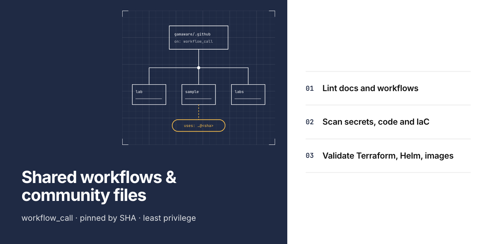
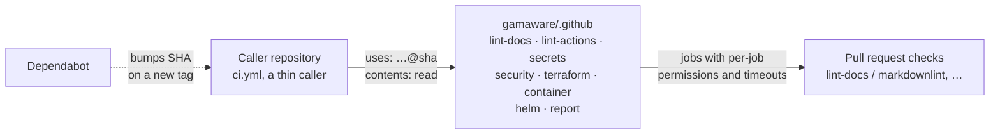

# gamaware/.github

Shared community health files, hardened reusable GitHub Actions workflows and the social preview generator for every
repository in the [AWS DevOps portfolio](https://github.com/gamaware/aws-devops-portfolio).

[](https://github.com/gamaware/.github/actions/workflows/ci.yml)
[](LICENSE)



## What this proves

- **Community health files** that GitHub applies to every repository without its own copy: contributing guide, code
  of conduct (Contributor Covenant 2.1), support, security policy, issue forms and a pull request template that asks
  for evidence and documentation updates.
- **Eight reusable workflows** (`on: workflow_call`) so every repository runs the same checks under the same check
  names.
- **A social preview generator** that renders 1280x640 previews in the portfolio's editorial-split blueprint style.

## Inspect the deliverable

- Reusable workflows: [`.github/workflows/`](.github/workflows/)
- This repository's own pipeline: [`ci.yml`](.github/workflows/ci.yml) and
  [`scorecard.yml`](.github/workflows/scorecard.yml)
- Social preview generator: [`assets/social-preview/render.py`](assets/social-preview/render.py)
- Workflow reference (jobs, inputs, calling pattern, release steps): [`docs/workflows.md`](docs/workflows.md)
- Social preview spec format and offer colors: [`docs/social-preview.md`](docs/social-preview.md)
- Pinned tool versions for the whole portfolio: [`docs/toolchain.md`](docs/toolchain.md)
- Decisions: [`docs/adr/`](docs/adr/README.md)

## Scenario and acceptance criteria

Ten portfolio repositories (Terraform, containers, Helm, Python and reports) need the same lint, secret and security
checks. Copying workflow files into each one lets versions and check names drift. This repository holds one copy that
every caller references.

Acceptance criteria:

- Every caller references a reusable workflow by full commit SHA and grants only `contents: read`.
- Required check names, such as `lint-docs / markdownlint`, are identical across repositories.
- Reusable validation workflows require no caller-supplied secrets or AWS credentials.
- Every downloaded binary passes a SHA-256 check, and every job has a timeout.
- `make verify` passes locally and in CI.

## Architecture



A repository keeps a thin `ci.yml` that calls only the workflows its stack needs, pinned to a full commit SHA of this
repository. Each reusable workflow starts from `permissions: {}`, grants `contents: read` per job, pins every action by
SHA, verifies every downloaded release binary against a SHA-256 checksum, sets `timeout-minutes` on every job and passes
inputs to shell steps only through environment variables. Source: [`docs/diagrams/`](docs/diagrams/).

## Verify locally

Prerequisites: Python 3.13, pre-commit 4.6.2 and Git ([toolchain](docs/toolchain.md)). Hook tools (actionlint,
zizmor, gitleaks, markdownlint-cli2, yamllint, shellcheck, shellharden, ruff) install through pre-commit on first run;
shellharden builds with a Rust toolchain that pre-commit bootstraps if needed.

```bash
pre-commit install --install-hooks
pre-commit install --hook-type commit-msg
make verify
```

Expected output: every hook reports `Passed`. The first run takes a few minutes while hook environments install;
later runs take under 30 seconds. `make vale` runs the prose check that CI runs in `lint-docs`. `make test-helm` runs
the `helm` workflow's lint step against the fixture charts in `tests/helm/` (needs `helm` and `yq`), as the
`test-helm` CI job does.

## Repository map

```text
.
├── .github/
│   ├── ISSUE_TEMPLATE/          bug and suggestion forms, contact links
│   ├── PULL_REQUEST_TEMPLATE.md summary, evidence, documentation checklist
│   ├── dependabot.yml           weekly GitHub Actions updates
│   └── workflows/               eight reusable workflows plus ci, scorecard and hook updates
├── assets/social-preview/       render.py, vendored fonts, example spec and output
├── docs/
│   ├── adr/                     architecture decision records
│   ├── diagrams/                Mermaid source and exported SVG
│   ├── social-preview.md        preview spec format and offer colors
│   ├── toolchain.md             pinned tool versions for every repository
│   └── workflows.md             reusable workflow reference and calling pattern
├── CODE_OF_CONDUCT.md           Contributor Covenant 2.1
├── CONTRIBUTING.md              workflow and conventions for all repositories
├── SECURITY.md                  private reporting through security advisories
├── SUPPORT.md                   where to ask for help
├── tests/helm/                  fixture charts and the helm workflow test
└── Makefile                     make verify, make vale, make preview, make test-helm
```

## Decisions and trade-offs

Architecture decision records follow the *Fundamentals of Software Architecture* (2nd ed.) format.

| Number | Title | Status |
| --- | --- | --- |
| [0001](docs/adr/0001-reusable-workflows-pinned-by-sha.md) | Share CI through reusable workflows pinned by commit SHA | Accepted |
| [0002](docs/adr/0002-checksum-verified-tool-binaries.md) | Install scanners as checksum-verified release binaries | Accepted |

## Security and quality gates

| Gate | Tool | Why |
| --- | --- | --- |
| Workflow correctness | actionlint | Catches expression, type and shell errors before a caller hits them |
| Workflow security | zizmor (pedantic) | Template injection, excessive permissions, unpinned uses, credential persistence |
| Secrets | gitleaks, detect-secrets | Full-history scan in CI, baseline-backed scan on commit |
| Docs | markdownlint-cli2, lychee, Vale | Consistent Markdown, no dead links, plain prose |
| YAML, Python, shell | yamllint, ruff, shellcheck, shellharden | Config and generator code stay lint-clean |
| Supply chain | OpenSSF Scorecard, Dependabot | Weekly posture check and SHA bumps for every pinned action |

## Limits and production adaptations

- Tool versions and checksums inside the workflows need manual updates; Dependabot only bumps `uses:` references.
  A production setup would add a scheduled job that checks for new releases and opens a pull request.
- The workflows target `ubuntu-24.04` x86-64 runners only.
- Checkov and pre-commit install from PyPI pinned by version, without hash-locked dependencies, and `vale sync`
  downloads style packages unpinned. Hash-locked requirement files would close that gap.
- Results print to the job log; nothing uploads SARIF. Upload to code scanning needs `security-events: write`, which
  these workflows avoid granting to pull requests.
- This repository has no profile README; the
  [portfolio index](https://github.com/gamaware/aws-devops-portfolio) plays that role.

## Related work

- [AWS DevOps portfolio](https://github.com/gamaware/aws-devops-portfolio): index of every lab and sample deliverable
  that calls these workflows.

## License

[MIT](LICENSE). Vendored fonts keep their own SIL Open Font License 1.1.
